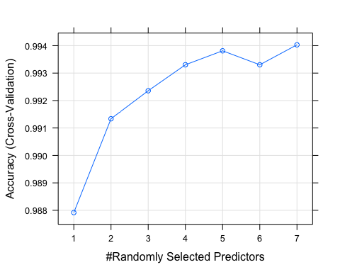

# Human Activity Recognition: Predicting Quality
Dylan Tweed  
July 31, 2016  

# Abstract

For a total of 6 subject, data from accelerometers on the belt, forearm, arm, and dumbell were collected while performing barbell lifts correctly and incorrectly in 5 different ways. Using random forest machine learning algorithm, we created a model to infer from the data, how the exercise was performed. With a out of sample error rate smaller than 0.3 %,
we can provide diagnostics helping future users to optimize their training exercise and avoid potential injury. 

# Data set

The data for this project was made publicly available in. [http://groupware.les.inf.puc-rio.br/har](http://groupware.les.inf.puc-rio.br/har) [^1]. Further detail can be found in [http://groupware.les.inf.puc-rio.br](http://groupware.les.inf.puc-rio.br/har#ixzz4FytImzrr). 

## HAR Training and HAR Testing data sets


```r
HARtrain <- read.csv("pml-training.csv")
HARtest <- read.csv("pml-testing.csv")
```


Source files:

* HAR training data set: [pml-training.csv](https://d396qusza40orc.cloudfront.net/predmachlearn/pml-training.csv) contains:
    * 19622 measurements with 160 observations. 
    * 67 columns contain some missing value
    * 0 columns contain only missing value
    * The last column being the `class` a factor variable A to E, referring to the quality of the exercise
* HAR testing data set: [pml-testing.csv](https://d396qusza40orc.cloudfront.net/predmachlearn/pml-testing.csv) contains:
    * 20 measurements with 160 observations.
    * 100 columns contain some missing values
    * 100 columns contain only missing values
    * The last column being the `problem_id`, this data set constitute a blind test for the model we create from the HAR training data set. 
* For both data sets the first 7 entries correspond to the subject names the date and experimental setup. We shall neglect these variables since our model should not depend or rely on those.

## Preprocessing: Column selection

As the HAR testing data set contains the least number of observable, we shall use this set to select the relevant variables.


```r
selectcol <- apply(HARtest,2,function(tcol){!sum(is.na(tcol)) > 0})
## Ignore the first 7 variables
selectcol[1:7] <- F
## Ignore the problem id variable
selectcol["problem_id"] <- F
selectvar <- names(HARtest)[selectcol]
```

After post-processing the following 52 variables remain:


```
##  [1] "roll_belt"            "pitch_belt"           "yaw_belt"            
##  [4] "total_accel_belt"     "gyros_belt_x"         "gyros_belt_y"        
##  [7] "gyros_belt_z"         "accel_belt_x"         "accel_belt_y"        
## [10] "accel_belt_z"         "magnet_belt_x"        "magnet_belt_y"       
## [13] "magnet_belt_z"        "roll_arm"             "pitch_arm"           
## [16] "yaw_arm"              "total_accel_arm"      "gyros_arm_x"         
## [19] "gyros_arm_y"          "gyros_arm_z"          "accel_arm_x"         
## [22] "accel_arm_y"          "accel_arm_z"          "magnet_arm_x"        
## [25] "magnet_arm_y"         "magnet_arm_z"         "roll_dumbbell"       
## [28] "pitch_dumbbell"       "yaw_dumbbell"         "total_accel_dumbbell"
## [31] "gyros_dumbbell_x"     "gyros_dumbbell_y"     "gyros_dumbbell_z"    
## [34] "accel_dumbbell_x"     "accel_dumbbell_y"     "accel_dumbbell_z"    
## [37] "magnet_dumbbell_x"    "magnet_dumbbell_y"    "magnet_dumbbell_z"   
## [40] "roll_forearm"         "pitch_forearm"        "yaw_forearm"         
## [43] "total_accel_forearm"  "gyros_forearm_x"      "gyros_forearm_y"     
## [46] "gyros_forearm_z"      "accel_forearm_x"      "accel_forearm_y"     
## [49] "accel_forearm_z"      "magnet_forearm_x"     "magnet_forearm_y"    
## [52] "magnet_forearm_z"
```

## Preprocessing: training and testing data sets

We create training and testing data set from the HAR train data set. 


```r
library(caret)
selectvar <- names(HARtest)[selectcol]
set.seed(3855)
inTrain = createDataPartition(HARtrain$class, p = 0.7,list=F)
# Save classication as seperate factor varaible 
classtrain <- HARtrain[inTrain,"classe"]
classtest  <- HARtrain[-inTrain,"classe"]
# Save variable used for both training and testing sets
training <- HARtrain[inTrain,selectvar]
testing <- HARtrain[-inTrain,selectvar]
```

* The training sample contains 13737 observations
* The testing sample contains 5885 observations

[^1]:Velloso, E.; Bulling, A.; Gellersen, H.; Ugulino, W.; Fuks, H. Qualitative Activity Recognition of Weight Lifting Exercises. Proceedings of 4th International Conference in Cooperation with SIGCHI (Augmented Human '13) . Stuttgart, Germany: ACM SIGCHI, 2013.]

# Machine learning: random forest

Preliminary testing, on a small subset of the training sample show that: 

* decision tree (method `rpart`), with and without PCA show bad performance
* boosting (method `gbm`), shows better performance that the decision trees, both with and without PCA, but at a cost of computational time
* Random forests (method `rf`), show the best performances, in term of in sample accuracy, within manageable computational time depending on the parameters. Using PCA didn't seem to show any significant effect on the performance.

Even though, we could have explore more models, and fine tune some parameter for improved performance. We choose to limit our modeling to random forest. We explore different values of parameter `mtry` limited to `sqrt(ncol(training)` in order to have an extra margin of tuning to the model.
Cross validation is preformed through 10-fold re-sampling.


```r
# Setting control parameters 10-fold resampling cross-validation
trCtrl <- trainControl(method="cv", number=10, search="random",trim=T)
# Setting mtry
mtry <- floor(sqrt(ncol(training)))
tGrid <- expand.grid(.mtry=c(1:mtry))
# Setting seed
set.seed(9696)
# Creating the model timing is save in rftime for 
system.time(
    modrf <- train(
        classtrain~.,data=training,method="rf",
        trControl=trCtrl,tuneGrid=tGrid)
)
```

```
##     user   system  elapsed 
## 2082.543   17.286 2102.173
```

## Parameter search

<div class="figure">

<p class="caption">Parameter tunning of the random forest</p>
</div>

We display the accuracy improvement for different values of `mtry`, the best model correspond to `mtry=7`. However, it corresponds to an improvement of 0.6 % compared to the least accurate model we tried at `mtry=1`.

## In sample error


```r
trainrf <- predict(modrf,training)
cMtrain <- confusionMatrix(classtrain,trainrf)
```


         A      B      C      D      E
---  -----  -----  -----  -----  -----
A     3906      0      0      0      0
B        0   2658      0      0      0
C        0      0   2396      0      0
D        0      0      0   2252      0
E        0      0      0      0   2525

The confusion matrix, show perfect classification for the training sample. 


            Sensitivity   Specificity   Pos Pred Value   Neg Pred Value   Prevalence   Detection Rate   Detection Prevalence   Balanced Accuracy
---------  ------------  ------------  ---------------  ---------------  -----------  ---------------  ---------------------  ------------------
Class: A              1             1                1                1       0.2843           0.2843                 0.2843                   1
Class: B              1             1                1                1       0.1935           0.1935                 0.1935                   1
Class: C              1             1                1                1       0.1744           0.1744                 0.1744                   1
Class: D              1             1                1                1       0.1639           0.1639                 0.1639                   1
Class: E              1             1                1                1       0.1838           0.1838                 0.1838                   1

As expected from the confusion matrix, the model show perfect sensitivity and specificity within the training sample for all classes.

## Out of sample error


```r
testrf <- predict(modrf,testing)
cMtest <- confusionMatrix(classtest,testrf)
```

The confusion matrix, show very reliable classification on the testing sample, a few mis-classifications occur as could be expected for an out of sample test.


         A      B      C     D      E
---  -----  -----  -----  ----  -----
A     1673      1      0     0      0
B        2   1136      1     0      0
C        0      2   1024     0      0
D        0      0      6   957      1
E        0      0      0     2   1080

The out of sample accuracy is extremely good, which make us confident on the validity of our model. 


 Accuracy    Kappa   AccuracyLower   AccuracyUpper   AccuracyNull
---------  -------  --------------  --------------  -------------
   0.9975   0.9968          0.9958          0.9986         0.2846

This is further confirmed in more detail with the different accuracy estimates displayed per class in the following table.


            Sensitivity   Specificity   Pos Pred Value   Neg Pred Value   Prevalence   Detection Rate   Detection Prevalence   Balanced Accuracy
---------  ------------  ------------  ---------------  ---------------  -----------  ---------------  ---------------------  ------------------
Class: A         0.9988        0.9998           0.9994           0.9995       0.2846           0.2843                 0.2845              0.9993
Class: B         0.9974        0.9994           0.9974           0.9994       0.1935           0.1930                 0.1935              0.9984
Class: C         0.9932        0.9996           0.9981           0.9986       0.1752           0.1740                 0.1743              0.9964
Class: D         0.9979        0.9986           0.9927           0.9996       0.1630           0.1626                 0.1638              0.9982
Class: E         0.9991        0.9996           0.9982           0.9998       0.1837           0.1835                 0.1839              0.9993

## Error summary

* In Sample Error 0
* 10 fold cross validation error for the best model 0.00597
* Out of Sample Error 0.00255

# Model predictions

We can now perform the model prediction on the testing sample `HARtest`
We perform the same columns selection as for the training data sample `HARtrain`. Arguably the column selection was performed of the `HARtest` test sample. 


```r
Quiztest <- HARtest[,selectcol]
Quizclass <- data.frame(
    problem_id = HARtest[,"problem_id"],
    classe_pred = predict(modrf,Quiztest)
) 
```

The result is saved in a new data frame that we displayed with the following command. For this report however we do not display the result.


```r
library(knitr)
kable(Quizclass)
```
